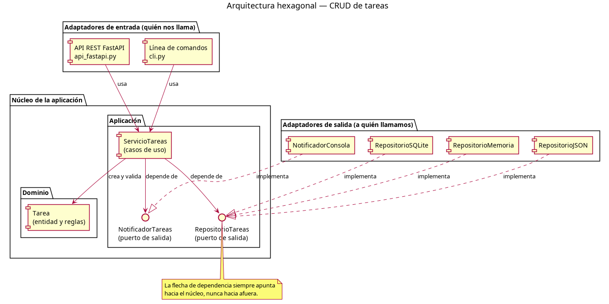
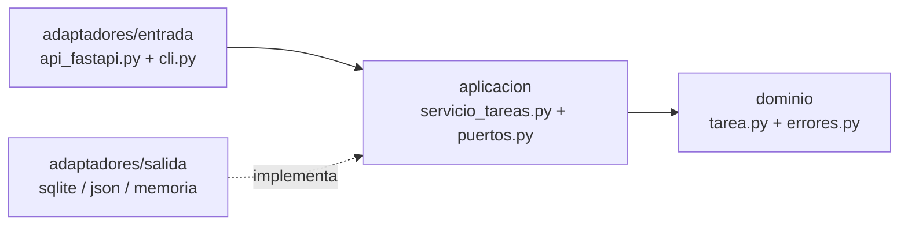
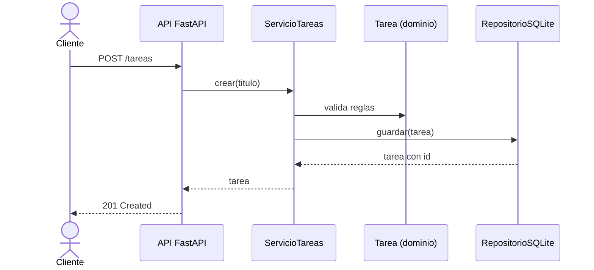

# 🧩 Arquitectura Hexagonal en Python — CRUD de tareas

[](https://github.com/nico-alvz/arquitectura-hexagonal-python/actions/workflows/ci.yml)

[](LICENSE)

Una aplicación de gestión de tareas que muestra cómo separar las reglas de negocio de la interfaz de usuario y del almacenamiento. Los mismos casos de uso se ejecutan desde una API con FastAPI o desde la terminal, y permiten guardar las tareas en SQLite, JSON o memoria.

El código y las pruebas permiten seguir una operación de principio a fin: desde la entrada del usuario hasta el dominio, pasando por los contratos que conectan la aplicación con sus adaptadores.

## 📚 Tabla de contenidos

- [¿Qué es la arquitectura hexagonal?](#-qué-es-la-arquitectura-hexagonal)
- [Diagramas](#-diagramas)
- [Estructura del proyecto](#-estructura-del-proyecto)
- [Ruta de lectura](#ruta-de-lectura)
- [Inicio rápido](#-inicio-rápido)
- [Uso de la API](#-uso-de-la-api)
- [Práctica guiada](docs/recorrido-guiado.md)
- [Cómo expandir](#-cómo-expandir)
- [Pruebas](#-pruebas)
- [CI/CD](#-cicd)
- [Referencias y créditos](#-referencias-y-créditos)
- [Contribuir](#-contribuir)
- [Licencia](#-licencia)

## 💡 ¿Qué es la arquitectura hexagonal?

La arquitectura hexagonal organiza la aplicación alrededor de un núcleo: el dominio y los casos de uso. Ese núcleo expresa qué puede hacer la aplicación y qué necesita del exterior; los adaptadores resuelven los detalles de HTTP, terminal o almacenamiento.

| Pieza | Responsabilidad | Ejemplo en este proyecto |
|---|---|---|
| **Dominio** | Representar las tareas y validar sus reglas | `Tarea` exige un título con contenido y de hasta 100 caracteres |
| **Aplicación** | Coordinar los casos de uso | `ServicioTareas` crea, consulta, actualiza y elimina tareas |
| **Puerto de entrada** | Exponer las operaciones que se pueden ejecutar | Los métodos públicos de `ServicioTareas`; aquí no hay una interfaz abstracta separada |
| **Puertos de salida** | Definir lo que la aplicación necesita del exterior | `RepositorioTareas` y `NotificadorTareas` |
| **Adaptadores de entrada** | Traducir una petición del usuario a un caso de uso | API FastAPI y CLI |
| **Adaptadores de salida** | Implementar los contratos del núcleo | Repositorios SQLite, JSON y memoria; notificadores de consola y memoria |
| **Composición** | Elegir e inyectar las implementaciones | `composicion.py`, compartido por API y CLI |

**La dirección de las dependencias es la clave:** el servicio importa el contrato `RepositorioTareas`, y cada repositorio concreto también depende de ese contrato. El servicio recibe la implementación por el constructor, sin importar SQLite ni JSON. Esto permite sustituir un adaptador manteniendo los mismos casos de uso.

Durante la ejecución, el servicio sí llama al repositorio concreto. El diagrama de dependencias describe qué módulos conoce el código; el diagrama de secuencia muestra qué objetos colaboran al atender una petición.

## 🗺️ Diagramas

### Vista general (PlantUML)



### Dependencias entre carpetas (Mermaid)



### Qué pasa al crear una tarea (Mermaid)



Más diagramas PlantUML en [`docs/diagramas/`](docs/diagramas): secuencia y despliegue (archivos `.puml` editables y su `.png`).

## 📁 Estructura del proyecto

```text
src/tareas/
├── dominio/                  # Reglas del negocio (Python puro)
│   ├── tarea.py              #   Entidad Tarea
│   └── errores.py            #   Errores del negocio
├── aplicacion/               # Casos de uso
│   ├── puertos.py            #   Contratos: RepositorioTareas y NotificadorTareas
│   └── servicio_tareas.py    #   CRUD (crear, obtener, listar, actualizar, eliminar)
├── adaptadores/
│   ├── entrada/
│   │   ├── api_fastapi.py    #   API REST (quien llama al núcleo)
│   │   └── cli.py            #   Línea de comandos
│   └── salida/
│       ├── repositorio_memoria.py
│       ├── repositorio_sqlite.py
│       ├── repositorio_json.py
│       ├── notificador_consola.py
│       └── notificador_memoria.py
├── composicion.py            # Elige y conecta los adaptadores
├── principal.py              # Arranque de la API
└── principal_cli.py          # Arranque de la línea de comandos
tests/                        # Pruebas unitarias y de integración
Containerfile                 # Imagen (Podman y Docker)
.github/workflows/ci.yml      # CI/CD
```

## Ruta de lectura

1. Lee [`dominio/tarea.py`](src/tareas/dominio/tarea.py): identifica la regla del título y los datos de una tarea.
2. Revisa [`aplicacion/puertos.py`](src/tareas/aplicacion/puertos.py): observa qué operaciones necesita el servicio para persistir y notificar.
3. Sigue `crear` y `actualizar` en [`servicio_tareas.py`](src/tareas/aplicacion/servicio_tareas.py): el servicio valida, guarda y notifica al pasar de pendiente a completada.
4. Compara los [adaptadores de salida](src/tareas/adaptadores/salida) y después los [de entrada](src/tareas/adaptadores/entrada): cambia la tecnología, pero se mantienen los contratos y los casos de uso.
5. Termina en [`composicion.py`](src/tareas/composicion.py) y ejecuta la [práctica guiada](docs/recorrido-guiado.md) para comprobar las conexiones con ejemplos.

## 🚀 Inicio rápido

Ejecuta los comandos desde la raíz del repositorio.

### Opción A — Con Podman (o Docker)

Requiere Make y el motor de contenedores elegido.

```bash
make contenedor            # usa Podman
# Alternativa con Docker:
# make contenedor MOTOR=docker
```

Abre <http://localhost:8000/docs>. SQLite se guarda en el volumen `tareas-datos`, que conserva las tareas entre ejecuciones.

### Opción B — Con Python

Requiere Python 3.12 o superior y Make.

```bash
python -m venv .venv
source .venv/bin/activate
make instalar
make ejecutar
```

Abre <http://localhost:8000/docs> para probar la API desde el navegador.

### Elegir el almacenamiento

| Variable | Valor por defecto | Uso |
|---|---|---|
| `REPOSITORIO` | `sqlite` | Selecciona `sqlite`, `json` o `memoria` |
| `RUTA_DB` | `tareas.db` | Archivo usado por SQLite |
| `RUTA_JSON` | `tareas.json` | Archivo usado por JSON |

Por ejemplo: `REPOSITORIO=json make ejecutar`. Las rutas relativas se resuelven desde el directorio donde ejecutas el proceso; en la imagen, `RUTA_DB` apunta a `/datos/tareas.db`.

En memoria, los datos duran lo que dura la instancia del repositorio: al reiniciar la API se pierden, y cada ejecución de la CLI empieza vacía. SQLite y JSON conservan los datos en archivos. Usa los valores indicados para `REPOSITORIO`: actualmente, un valor desconocido también selecciona SQLite.

## 🔌 Uso de la API

| Método | Ruta | Descripción |
|---|---|---|
| `POST` | `/tareas` | Crear una tarea |
| `GET` | `/tareas` | Listar tareas |
| `GET` | `/tareas/{id}` | Obtener una tarea |
| `PATCH` | `/tareas/{id}` | Actualizar campos de una tarea |
| `DELETE` | `/tareas/{id}` | Eliminar una tarea |
| `GET` | `/salud` | Comprobar que la API responde |

```bash
curl -i -X POST localhost:8000/tareas -H 'Content-Type: application/json' \
     -d '{"titulo": "Aprender arquitectura hexagonal"}'

# Reemplaza 1 por el id que devolvió la creación.
curl -i -X PATCH localhost:8000/tareas/1 -H 'Content-Type: application/json' \
     -d '{"completada": true}'
```

La creación responde `201` con una tarea como esta (el `id` depende de los datos existentes):

```json
{"id": 1, "titulo": "Aprender arquitectura hexagonal", "descripcion": "", "completada": false}
```

Al completar la tarea, la respuesta tiene `completada: true` y el notificador imprime un aviso en la consola del servidor. Repetir la actualización con `true` no genera otro aviso; volver a pendiente y completarla de nuevo sí lo genera.

Para observar la traducción de errores, prueba un título con solo espacios:

```bash
curl -i -X POST localhost:8000/tareas -H 'Content-Type: application/json' \
     -d '{"titulo": "   "}'
```

El dominio lanza `TituloInvalido` y el adaptador HTTP responde `422` con `{"detail":"El título no puede estar vacío"}`. Si una tarea no existe, el servicio lanza `TareaNoEncontrada` y la API responde `404`. La CLI traduce esos mismos errores a un mensaje y un código de salida `1`.

## 🔧 Cómo expandir

¿Quieres agregar otra base de datos, otro aviso o una nueva forma de usar la app? Lee la **[guía para expandir](docs/como-extender.md)**. Incluye ejemplos reales de:

- Un nuevo **adaptador de salida** (`RepositorioJSON`).
- Un nuevo **puerto** (`NotificadorTareas`) con su adaptador.
- Un nuevo **adaptador de entrada** (línea de comandos).
- Pruebas de **contrato** que cualquier repositorio debe cumplir.

```bash
PYTHONPATH=src REPOSITORIO=json python -m tareas.principal_cli crear "Mi primera tarea"
```

El [recorrido guiado](docs/recorrido-guiado.md) incluye una demostración sin servidor, un flujo completo por CLI y ejercicios con criterios de comprobación.

## ✅ Pruebas

```bash
make test    # pruebas
make lint    # estilo (ruff)
```

- `tests/test_servicio_tareas.py`: prueba el núcleo con el repositorio en memoria (sin HTTP ni SQL).
- `tests/test_api.py`: prueba la API completa sobre SQLite.
- `tests/test_contrato_repositorio.py`: la misma batería para **todos** los repositorios.
- `tests/test_notificador.py` y `tests/test_cli.py`: el segundo puerto y el adaptador de consola.

## ⚙️ CI/CD

El flujo [`ci.yml`](.github/workflows/ci.yml) de GitHub Actions:

1. **Lint y pruebas** en pushes a `main`, tags `v*` y Pull Requests dirigidos a `main`.
2. **Construye la imagen** con Docker Buildx a partir del `Containerfile`.
3. **Publica la imagen** en GitHub Container Registry (`ghcr.io/nico-alvz/arquitectura-hexagonal-python`) al hacer push a `main` o a un tag `v*`.

```bash
podman run --rm -p 8000:8000 ghcr.io/nico-alvz/arquitectura-hexagonal-python:latest
```

## 📖 Referencias y créditos

Para profundizar, recomendamos el artículo de Herberto Graça
[DDD, Hexagonal, Onion, Clean, CQRS, … How I put it all together](https://herbertograca.com/2017/11/16/explicit-architecture-01-ddd-hexagonal-onion-clean-cqrs-how-i-put-it-all-together/),
que incluye su infografía *Explicit Architecture* (con ayuda de Francesco Mastrogiacomo).

[](https://herbertograca.com/2017/11/16/explicit-architecture-01-ddd-hexagonal-onion-clean-cqrs-how-i-put-it-all-together/)

*Imagen: «Explicit Architecture» © Herberto Graça, tomada de [herbertograca.com](https://herbertograca.com). Se muestra enlazada desde su sitio original, no se almacena en este repositorio, y todos los derechos pertenecen a su autor.*

> Los diagramas de `docs/diagramas/` son propios de este proyecto.

## 🤝 Contribuir

Lee [CONTRIBUTING.md](CONTRIBUTING.md). Los commits siguen [Conventional Commits](https://www.conventionalcommits.org/es/v1.0.0/) en inglés.

## 📄 Licencia

[MIT](LICENSE)
