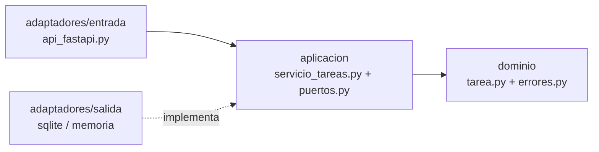
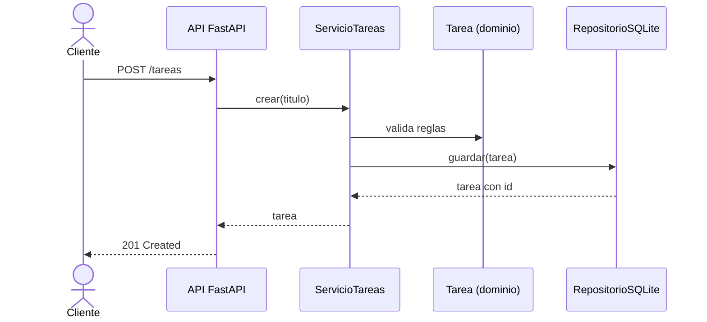

# 🧩 Arquitectura Hexagonal en Python — CRUD de tareas

[](https://github.com/nico-alvz/arquitectura-hexagonal-python/actions/workflows/ci.yml)

[](LICENSE)

Un ejemplo **pequeño y muy comentado** de arquitectura hexagonal (puertos y adaptadores) con Python y FastAPI. Es una API para crear, leer, actualizar y eliminar tareas, pensada para **entender la arquitectura**, no para impresionar con funcionalidades.

## 📚 Tabla de contenidos

- [¿Qué es la arquitectura hexagonal?](#-qué-es-la-arquitectura-hexagonal)
- [Diagramas](#-diagramas)
- [Estructura del proyecto](#-estructura-del-proyecto)
- [Inicio rápido](#-inicio-rápido)
- [Uso de la API](#-uso-de-la-api)
- [Pruebas](#-pruebas)
- [CI/CD](#-cicd)
- [Contribuir](#-contribuir)
- [Licencia](#-licencia)

## 💡 ¿Qué es la arquitectura hexagonal?

La idea: **la lógica de negocio no debe depender de la tecnología** (web, base de datos, etc.). Se logra con tres piezas:

| Pieza | Qué es | Aquí |
|---|---|---|
| **Dominio** | Las reglas del negocio, en Python puro | `Tarea` |
| **Puerto** | Una interfaz: lo que el núcleo *necesita* | `RepositorioTareas` |
| **Adaptador** | Una implementación concreta de un puerto, o quien llama al núcleo | FastAPI, SQLite, memoria |

**Ventaja práctica:** puedes cambiar SQLite por PostgreSQL, o FastAPI por una línea de comandos, escribiendo un adaptador nuevo sin tocar el núcleo. Además, el núcleo se prueba sin levantar nada.

## 🗺️ Diagramas

### Vista general (PlantUML)


### Dependencias entre carpetas (Mermaid)



### Qué pasa al crear una tarea (Mermaid)



Más diagramas PlantUML en [`docs/diagramas/`](docs/diagramas): secuencia y despliegue (archivos `.puml` editables y su `.png`).

## 📁 Estructura del proyecto

```text
src/tareas/
├── dominio/                  # Reglas del negocio (Python puro)
│   ├── tarea.py              #   Entidad Tarea
│   └── errores.py            #   Errores del negocio
├── aplicacion/               # Casos de uso
│   ├── puertos.py            #   Interfaz RepositorioTareas
│   └── servicio_tareas.py    #   CRUD (crear, obtener, listar, actualizar, eliminar)
├── adaptadores/
│   ├── entrada/
│   │   └── api_fastapi.py    #   API REST (quien llama al núcleo)
│   └── salida/
│       ├── repositorio_memoria.py
│       └── repositorio_sqlite.py
└── principal.py              # Conecta todas las piezas
tests/                        # Pruebas unitarias y de integración
Containerfile                 # Imagen (Podman y Docker)
.github/workflows/ci.yml      # CI/CD
```

**Tip para leer el código:** empieza por `dominio/tarea.py`, sigue con `aplicacion/`, luego los adaptadores, y termina en `principal.py`.

## 🚀 Inicio rápido

### Opción A — Con Podman (o Docker)

```bash
make contenedor            # usa Podman
make contenedor MOTOR=docker
```

Abre <http://localhost:8000/docs>.

### Opción B — Con Python

Requiere Python 3.12 o superior.

```bash
python -m venv .venv && source .venv/bin/activate
make instalar
make ejecutar
```

Abre <http://localhost:8000/docs> para probar la API desde el navegador.

> Para usar memoria en vez de SQLite: `REPOSITORIO=memoria make ejecutar`.

## 🔌 Uso de la API

| Método | Ruta | Descripción |
|---|---|---|
| `POST` | `/tareas` | Crear una tarea |
| `GET` | `/tareas` | Listar tareas |
| `GET` | `/tareas/{id}` | Obtener una tarea |
| `PATCH` | `/tareas/{id}` | Actualizar campos de una tarea |
| `DELETE` | `/tareas/{id}` | Eliminar una tarea |
| `GET` | `/salud` | Comprobar que la API responde |

```bash
curl -X POST localhost:8000/tareas -H 'Content-Type: application/json' \
     -d '{"titulo": "Aprender arquitectura hexagonal"}'

curl -X PATCH localhost:8000/tareas/1 -H 'Content-Type: application/json' \
     -d '{"completada": true}'
```

## ✅ Pruebas

```bash
make test    # pruebas
make lint    # estilo (ruff)
```

- `tests/test_servicio_tareas.py`: prueba el núcleo con el repositorio en memoria (sin HTTP ni SQL).
- `tests/test_api.py`: prueba la API completa sobre SQLite.

## ⚙️ CI/CD

El flujo [`ci.yml`](.github/workflows/ci.yml) de GitHub Actions:

1. **Lint y pruebas** en cada push y Pull Request.
2. **Construye la imagen** con Docker Buildx a partir del `Containerfile`.
3. **Publica la imagen** en GitHub Container Registry (`ghcr.io/nico-alvz/arquitectura-hexagonal-python`) al hacer push a `main` o a un tag `v*`.

```bash
podman run --rm -p 8000:8000 ghcr.io/nico-alvz/arquitectura-hexagonal-python:latest
```

## 🤝 Contribuir

Lee [CONTRIBUTING.md](CONTRIBUTING.md). Los commits siguen [Conventional Commits](https://www.conventionalcommits.org/es/v1.0.0/) en inglés.

## 📄 Licencia

[MIT](LICENSE)
