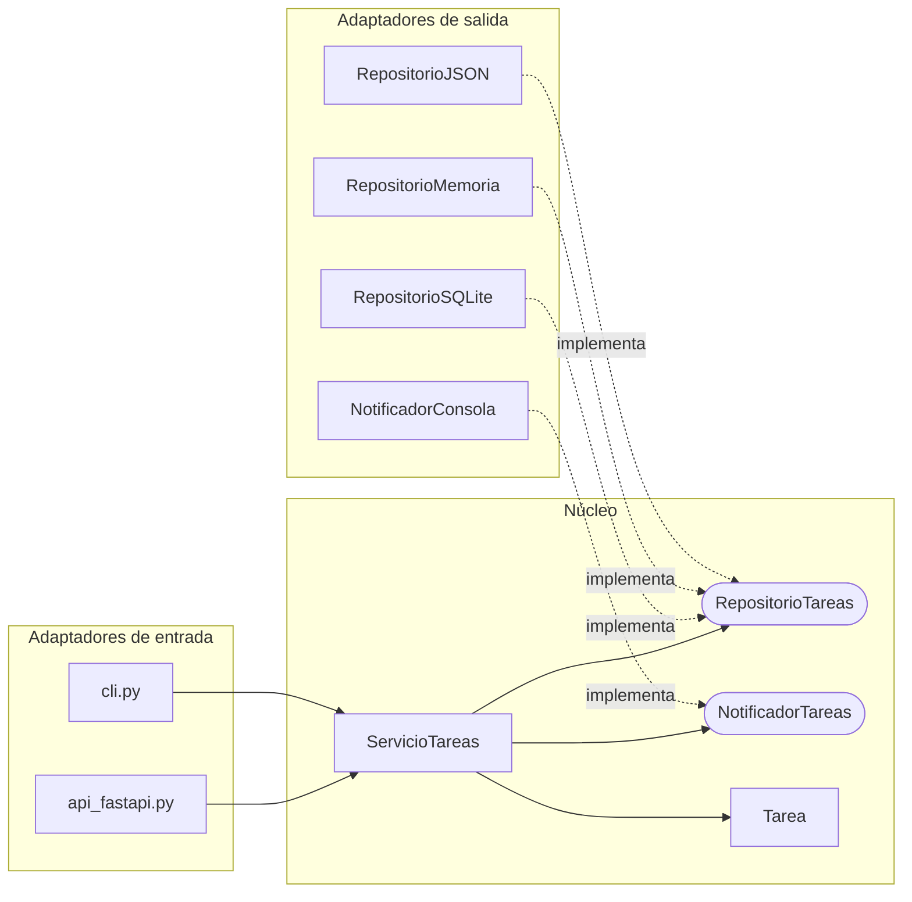

# 🔧 Cómo expandir la aplicación

Esta guía muestra cómo crecer sin romper lo que ya funciona. La regla de oro:

> **El núcleo define contratos (puertos); los adaptadores los cumplen.**
> Nunca al revés: el núcleo jamás importa un adaptador.



## ¿Qué es un contrato?

Un **puerto** es una clase abstracta (`ABC`) con métodos `@abstractmethod`. Es un contrato: quien lo implemente **está obligado** a ofrecer esos métodos. Python te avisa si olvidas alguno:

```python
class Incompleto(RepositorioTareas):
    pass


Incompleto()  # TypeError: Can't instantiate abstract class ...
```

Los contratos viven en [`aplicacion/puertos.py`](../src/tareas/aplicacion/puertos.py).

---

## Receta 1 — Agregar un adaptador de salida (otra forma de guardar)

**Ejemplo real:** [`repositorio_json.py`](../src/tareas/adaptadores/salida/repositorio_json.py).

1. Crea `adaptadores/salida/mi_repositorio.py` con una clase que herede de `RepositorioTareas`.
2. Implementa `guardar`, `obtener`, `listar` y `eliminar`.
3. **Agrégalo a las pruebas de contrato:** en [`tests/test_contrato_repositorio.py`](../tests/test_contrato_repositorio.py), suma tu opción a `params` y a la fixture. Si pasa esas pruebas, se comporta igual que los demás.
4. Actívalo en [`composicion.py`](../src/tareas/composicion.py) (por ejemplo, con un nuevo valor de `REPOSITORIO`).

No se modifica ni el dominio ni el servicio ni la API.

## Receta 2 — Agregar un puerto nuevo (una nueva necesidad del núcleo)

**Ejemplo real:** `NotificadorTareas`, que avisa cuando una tarea se completa.

1. **Define el contrato** en `aplicacion/puertos.py`:

   ```python
   class NotificadorTareas(ABC):
       @abstractmethod
       def tarea_completada(self, tarea: Tarea) -> None: ...
   ```

2. **Úsalo en el servicio** recibiéndolo por el constructor (inyección de dependencias). Mira [`servicio_tareas.py`](../src/tareas/aplicacion/servicio_tareas.py): avisa solo cuando la tarea pasa de pendiente a completada.
3. **Escribe adaptadores:** [`NotificadorConsola`](../src/tareas/adaptadores/salida/notificador_consola.py) para uso real y [`NotificadorMemoria`](../src/tareas/adaptadores/salida/notificador_memoria.py) para pruebas.
4. **Conéctalo** en `composicion.py`.

> Para enviar correos, bastaría con crear `NotificadorCorreo(NotificadorTareas)`. El servicio no cambia.

## Receta 3 — Agregar un adaptador de entrada (otra forma de usar la app)

**Ejemplo real:** [`cli.py`](../src/tareas/adaptadores/entrada/cli.py), una línea de comandos que reutiliza `ServicioTareas`.

```bash
REPOSITORIO=json python -m tareas.principal_cli crear "Mi tarea"
REPOSITORIO=json python -m tareas.principal_cli completar 1
REPOSITORIO=json python -m tareas.principal_cli listar
```

Los adaptadores de entrada reciben el servicio ya construido y solo traducen: entrada del usuario → llamada al servicio → salida.

## Receta 4 — Agregar un caso de uso nuevo

Ejemplo: "listar solo las pendientes".

1. Agrega un método a `ServicioTareas` (por ejemplo `listar_pendientes`). Si necesitas algo nuevo de la base de datos, primero amplía el contrato `RepositorioTareas` y luego **todos** sus adaptadores (las pruebas de contrato te avisarán de los que falten).
2. Expónlo en el adaptador de entrada que quieras (un endpoint, un comando).
3. Prueba el servicio con `RepositorioMemoria`, sin HTTP ni base de datos.

---

## ✅ Lista de verificación al extender

- [ ] ¿El núcleo (`dominio/` y `aplicacion/`) sigue sin importar nada de `adaptadores/`?
- [ ] ¿El adaptador nuevo cumple todo el contrato del puerto?
- [ ] ¿Agregué mis pruebas (y las de contrato, si es un repositorio)?
- [ ] ¿Comenté el código en español y actualicé el README si hacía falta?
